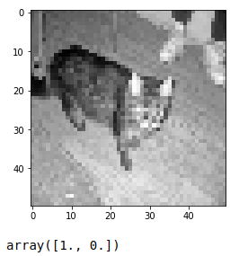

# Convolutional Neural Network to Determine Cat vs Dog

Harrison (@sentdex) has some more very thorough videos available on [https://pythonprogramming.net/](https://pythonprogramming.net/)

This document is the continuation of [tutorial-mnist.md](tutorial-mnist.md) and starts off with the video [Convnet Intro - Deep Learning and Neural Networks with Python and Pytorch p.5](https://www.youtube.com/watch?v=9aYuQmMJvjA&t=170s) from [Harrison's YouTube channel](https://www.youtube.com/c/sentdex/featured).  

## Checking your environment

Make sure you are in the correct conda environment. If you followed the [Install document](install.md), then you should be using `torch` as your conda environment. Switch to `torch` with:

```shell
conda activate torch
```

To make it easier, you can run the following code in a jupyter notebook by running the following:

```shell
jupyter notebook
```

As a sanity check, run the following code to make sure you are using the correct environment and using the GPU

```python
import sys
import torch
import os
print(f"Conda Environment: {os.environ['CONDA_DEFAULT_ENV']}")

print(f"PyTorch Version: {torch.__version__}")
print()
print(f"Python {sys.version}")
print("GPU is", "available" if torch.cuda.is_available() else "NOT AVAILABLE")
```

If you followed the [Install document](install.md), you should see something similar to:

```shell
Conda Environment: torch
PyTorch Version: 1.12.0

Python 3.8.13 (default, Mar 28 2022, 11:38:47) 
[GCC 10.3.0]
GPU is available
```

The versions of Python and GCC may change, but you want to make sure you are in the `torch` Conda Environment and that `GPU is available`

## Install OpenCV in this environment

Note: You may have to install opencv if you haven't installed it in this environment yet. You can do that by typing the following, it may take a while for the dependencies etc to be determined:

```shell
pip3 install opencv-python==4.4.0.40
```

We also need to install tqdm, it can be installed with:

```shell
conda install -c conda-forge tqdm
```

We now create a class to hold our Cats and Dogs:

```python
import os
import cv2
import numpy as np
from tqdm import tqdm

REBUILD_DATA = False # set to True once, then back to False unless you want to change something in your training data.


class DogsVSCats():
    IMG_SIZE = 50
    CATS = "data/PetImages/Cat"
    DOGS = "data/PetImages/Dog"
    LABELS = {CATS: 0, DOGS: 1}
    training_data = []
    catcount = 0
    dogcount = 0

    def make_training_data(self):
        for label in self.LABELS:
            print("Loading from:", label)
            for f in  tqdm(os.listdir(label)):
                try:
                    path = os.path.join(label, f)
                    # print out the file being read
                    #print ("loading image at", path)
                    img = cv2.imread(path, cv2.IMREAD_GRAYSCALE)
                    img = cv2.resize(img, (self.IMG_SIZE, self.IMG_SIZE))
                    self.training_data.append([np.array(img), np.eye(2)[self.LABELS[label]]])
                    #print("Label", np.eye(2)[self.LABELS[label]])
                    
                    if label == self.CATS:
                        self.catcount += 1
                    elif label == self.DOGS:
                        self.dogcount += 1
                        
                except Exception as e:
                    pass 
                    #print(label, f, str(e))

        np.random.shuffle(self.training_data)
        np.save("training_data.npy", self.training_data)
        print("Cats:", self.catcount)
        print("Dogs:", self.dogcount)

# This should only be run one time
# then we can re-use the saved training data
if REBUILD_DATA: 
    dogsvcats = DogsVSCats()
    dogsvcats.make_training_data()


# Load the normalized data
training_data = np.load("training_data.npy", allow_pickle=True)
```

## Exploring the data

we can get a feel for the data by exploring it with:

```python
print(len(training_data))
```

and expect to see around 25000 items which is the number of images of cats and dogs we have available  

We can print one of the images with:

```python
print(training_data[0])
```

and expect to get something like the following. Note that we shuffled the data, so yours may look different. The first element is the raw image data and the second element contains our label

```shell
[array([[  2,   1,   1, ...,   2,   2,   1],
       [  2,   1,   2, ...,   2,   3,   2],
       [  2,   2,   1, ...,   2,   2,   1],
       ...,
       [ 12,  21,  31, ..., 205, 194, 181],
       [ 24,  32,  35, ..., 203, 189, 174],
       [ 32,  34,  33, ..., 200, 187, 172]], dtype=uint8)
 array([1., 0.])]
```

We can also take a look at the image and label individually with:

```python
import matplotlib.pyplot as plt
# Note that we are telling the image to be shown in grayscale
plt.imshow(training_data[0][0], cmap="gray")
plt.show()
training_data[0][1]
```

it should show something similar to:



>Note that the image you see may be different since we shuffle the array of raw images.  
>Also note the array([1., 0.[]), which corresponds to a label of "cat" for this image

## Creating a Model

In the previous steps, we loaded a sample training set and explored it. We are now ready to Create a Neural Network! This is following [Training Convnet - Deep Learning and Neural Networks with Python and Pytorch p.6](https://pythonprogramming.net/convnet-model-deep-learning-neural-network-pytorch/)

We start out by creating a class for our network, the tutorial goes into great depth as to why we do things this way. Pay particular attention to why we have the line that start with `if self._to_linear is None:`  

I have copied and pasted the code here for easy copy paste

```python
import torch
import torch.nn as nn
import torch.nn.functional as F

class Net(nn.Module):
    def __init__(self):
        super().__init__() # just run the init of parent class (nn.Module)
        self.conv1 = nn.Conv2d(1, 32, 5) # input is 1 image, 32 output channels, 5x5 kernel / window
        self.conv2 = nn.Conv2d(32, 64, 5) # input is 32, bc the first layer output 32. Then we say the output will be 64 channels, 5x5 kernel / window
        self.conv3 = nn.Conv2d(64, 128, 5)

        x = torch.randn(50,50).view(-1,1,50,50)
        self._to_linear = None
        self.convs(x)

        self.fc1 = nn.Linear(self._to_linear, 512) #flattening.
        self.fc2 = nn.Linear(512, 2) # 512 in, 2 out bc we're doing 2 classes (dog vs cat).

    def convs(self, x):
        # max pooling over 2x2
        x = F.max_pool2d(F.relu(self.conv1(x)), (2, 2))
        x = F.max_pool2d(F.relu(self.conv2(x)), (2, 2))
        x = F.max_pool2d(F.relu(self.conv3(x)), (2, 2))

        if self._to_linear is None:
            self._to_linear = x[0].shape[0]*x[0].shape[1]*x[0].shape[2]
        return x
    
    def forward(self, x):
        x = self.convs(x)
        x = x.view(-1, self._to_linear)  # .view is reshape ... this flattens X before 
        x = F.relu(self.fc1(x))
        x = self.fc2(x) # bc this is our output layer. No activation here.
        return F.softmax(x, dim=1)
    
net = Net()
print(net)
```

## Partitioning our data into Train and Test sets

Once we have a model, we can setup an optimizer and loss metric as well as partition our data into Training and Testing sets.

```python
import torch.optim as optim

optimizer = optim.Adam(net.parameters(), lr=0.001)
loss_function = nn.MSELoss()

# I changed this to use np.array which runs a lot faster
# compared to the code in the original tutorial
X = torch.Tensor(np.array([i[0] for i in training_data])).view(-1,50,50)
X = X/255.0
y = torch.Tensor(np.array([i[1] for i in training_data]))

VAL_PCT = 0.1  # lets reserve 10% of our data for validation
val_size = int(len(X)*VAL_PCT)

train_X = X[:-val_size]
train_y = y[:-val_size]

test_X = X[-val_size:]
test_y = y[-val_size:]
print("Training items: ", len(train_X))
print("Testing items: ", len(test_X))

# split our data into batches
BATCH_SIZE = 100
EPOCHS = 1

# and run the epochs
for epoch in range(EPOCHS):
    for i in tqdm(range(0, len(train_X), BATCH_SIZE)): # from 0, to the len of x, stepping BATCH_SIZE at a time. [:50] ..for now just to dev
        #print(f"{i}:{i+BATCH_SIZE}")
        batch_X = train_X[i:i+BATCH_SIZE].view(-1, 1, 50, 50)
        batch_y = train_y[i:i+BATCH_SIZE]

        net.zero_grad()

        outputs = net(batch_X)
        loss = loss_function(outputs, batch_y)
        loss.backward()
        optimizer.step()    # Does the update

    print(f"Epoch: {epoch}. Loss: {loss}")
```

>Note: there is some discussion in the tutorial about which optimizer to use, it is worth a read / watch the video.

## Checking Accuracy

Since we trained our model, let's see how accurate it is:

```python
correct = 0
total = 0
with torch.no_grad():
    for i in tqdm(range(len(test_X))):
        real_class = torch.argmax(test_y[i])
        net_out = net(test_X[i].view(-1, 1, 50, 50))[0]  # returns a list, 
        predicted_class = torch.argmax(net_out)

        if predicted_class == real_class:
            correct += 1
        total += 1
print("Accuracy: ", round(correct/total, 3))
```

We only ran through our training data 1 time at this point, so accuracy may not be great. When I ran this, I got an accuracy of ~60 percent.  

We can run through the training multiple times by going back and changing the number of epochs in the previous code. I changed it to `EPOCHS = 4` and was able to get an accuracy of ~76 percent.  

Running multiple epochs will increase accuracy, but takes a longer amount of time. Up until now we have been running on the CPU, we can reduce our training time by running our training on the GPU.

## Running Training on the GPU

This portion of the tutorial is taken from
[Running on the GPU - Deep Learning and Neural Networks with Python and Pytorch p.7](https://pythonprogramming.net/gpu-deep-learning-neural-network-pytorch/) and [accompanying video](https://www.youtube.com/watch?v=6gk7giKER6s)

If you followed the [install.md[](install.md) document in this repo you should have the tooling installed and ready to go.  

As a sanity check, run the following code to make sure you are using the correct environment and using the GPU

```python
import sys
import torch
import os
print(f"Conda Environment: {os.environ['CONDA_DEFAULT_ENV']}")

print(f"PyTorch Version: {torch.__version__}")
print()
print(f"Python {sys.version}")
print("GPU is", "available" if torch.cuda.is_available() else "NOT AVAILABLE")
```

We need to make sure it says `GPU is available`  

The code up to now should be the following, note that there is a change from the tutorial since we call `np.array` before converting to a tensor. This change makes the code run faster when converting to a tensor. He also moved the train and test code into methods, which makes it easier to work with:

```python
import os
import cv2
import numpy as np
from tqdm import tqdm
import torch
import torch.nn as nn
import torch.nn.functional as F
import torch.optim as optim

REBUILD_DATA = False # set to true to one once, then back to false unless you want to change something in your training data.

class DogsVSCats():
    IMG_SIZE = 50
    CATS = "data/PetImages/Cat"
    DOGS = "data/PetImages/Dog"
    TESTING = "data/PetImages/Testing"
    LABELS = {CATS: 0, DOGS: 1}
    training_data = []

    catcount = 0
    dogcount = 0

    def make_training_data(self):
        for label in self.LABELS:
            print(label)
            for f in tqdm(os.listdir(label)):
                if "jpg" in f:
                    try:
                        path = os.path.join(label, f)
                        img = cv2.imread(path, cv2.IMREAD_GRAYSCALE)
                        img = cv2.resize(img, (self.IMG_SIZE, self.IMG_SIZE))
                        self.training_data.append([np.array(img), np.eye(2)[self.LABELS[label]]])  # do something like print(np.eye(2)[1]), just makes one_hot 
                        #print(np.eye(2)[self.LABELS[label]])

                        if label == self.CATS:
                            self.catcount += 1
                        elif label == self.DOGS:
                            self.dogcount += 1

                    except Exception as e:
                        pass
                        #print(label, f, str(e))

        np.random.shuffle(self.training_data)
        np.save("training_data.npy", self.training_data)
        print('Cats:',dogsvcats.catcount)
        print('Dogs:',dogsvcats.dogcount)


class Net(nn.Module):
    def __init__(self):
        super().__init__() # just run the init of parent class (nn.Module)
        self.conv1 = nn.Conv2d(1, 32, 5) # input is 1 image, 32 output channels, 5x5 kernel / window
        self.conv2 = nn.Conv2d(32, 64, 5) # input is 32, bc the first layer output 32. Then we say the output will be 64 channels, 5x5 kernel / window
        self.conv3 = nn.Conv2d(64, 128, 5)

        x = torch.randn(50,50).view(-1,1,50,50)
        self._to_linear = None
        self.convs(x)

        self.fc1 = nn.Linear(self._to_linear, 512) #flattening.
        self.fc2 = nn.Linear(512, 2) # 512 in, 2 out bc we're doing 2 classes (dog vs cat).

    def convs(self, x):
        # max pooling over 2x2
        x = F.max_pool2d(F.relu(self.conv1(x)), (2, 2))
        x = F.max_pool2d(F.relu(self.conv2(x)), (2, 2))
        x = F.max_pool2d(F.relu(self.conv3(x)), (2, 2))

        if self._to_linear is None:
            self._to_linear = x[0].shape[0]*x[0].shape[1]*x[0].shape[2]
        return x

    def forward(self, x):
        x = self.convs(x)
        x = x.view(-1, self._to_linear)  # .view is reshape ... this flattens X before 
        x = F.relu(self.fc1(x))
        x = self.fc2(x) # bc this is our output layer. No activation here.
        return F.softmax(x, dim=1)


net = Net()
print(net)

if REBUILD_DATA:
    dogsvcats = DogsVSCats()
    dogsvcats.make_training_data()

training_data = np.load("training_data.npy", allow_pickle=True)
print(len(training_data))

optimizer = optim.Adam(net.parameters(), lr=0.001)
loss_function = nn.MSELoss()

# This code is different than the tutorial, but runs faster
X = torch.Tensor(np.array([i[0] for i in training_data])).view(-1,50,50)
X = X/255.0
y = torch.Tensor(np.array([i[1] for i in training_data]))

VAL_PCT = 0.1  # lets reserve 10% of our data for validation
val_size = int(len(X)*VAL_PCT)

train_X = X[:-val_size]
train_y = y[:-val_size]

test_X = X[-val_size:]
test_y = y[-val_size:]

BATCH_SIZE = 100
EPOCHS = 1


def train(net):
    for epoch in range(EPOCHS):
        for i in tqdm(range(0, len(train_X), BATCH_SIZE)): # from 0, to the len of x, stepping BATCH_SIZE at a time. [:50] ..for now just to dev
            #print(f"{i}:{i+BATCH_SIZE}")
            batch_X = train_X[i:i+BATCH_SIZE].view(-1, 1, 50, 50)
            batch_y = train_y[i:i+BATCH_SIZE]

            net.zero_grad()

            outputs = net(batch_X)
            loss = loss_function(outputs, batch_y)
            loss.backward()
            optimizer.step()    # Does the update

        print(f"Epoch: {epoch}. Loss: {loss}")


def test(net):
    correct = 0
    total = 0
    with torch.no_grad():
        for i in tqdm(range(len(test_X))):
            real_class = torch.argmax(test_y[i])
            net_out = net(test_X[i].view(-1, 1, 50, 50))[0]  # returns a list, 
            predicted_class = torch.argmax(net_out)

            if predicted_class == real_class:
                correct += 1
            total += 1

    print("Accuracy: ", round(correct/total, 3))
```

### Move to cuda device

To make sure we are running on the GPU we need to check that it exists. This is different than the tutorial, but I think it makes more sense to look for the CUDA device this way.

```python
# Get cpu or gpu device for training.
device = "cuda" if torch.cuda.is_available() else "cpu"
print(f"Using {device} device")
```

move the model to the GPU device

```python
net.to(device)
```

we can now run the training on the GPU

```python
EPOCHS = 3

def train(net):
    optimizer = optim.Adam(net.parameters(), lr=0.001)
    BATCH_SIZE = 100
    EPOCHS = 3
    for epoch in range(EPOCHS):
        for i in range(0, len(train_X), BATCH_SIZE): # from 0, to the len of x, stepping BATCH_SIZE at a time. [:50] ..for now just to dev
            #print(f"{i}:{i+BATCH_SIZE}")
            batch_X = train_X[i:i+BATCH_SIZE].view(-1, 1, 50, 50)
            batch_y = train_y[i:i+BATCH_SIZE]

            batch_X, batch_y = batch_X.to(device), batch_y.to(device)
            net.zero_grad()

            optimizer.zero_grad()   # zero the gradient buffers
            outputs = net(batch_X)
            loss = loss_function(outputs, batch_y)
            loss.backward()
            optimizer.step()    # Does the update

        print(f"Epoch: {epoch}. Loss: {loss}")

train(net)
```

The above code should run much faster than when running on the CPU.

We can also run the test of accuracy on the GPU:

```python
test_X.to(device)
test_y.to(device)

def test(net):
    correct = 0
    total = 0
    with torch.no_grad():
        for i in tqdm(range(len(test_X))):
            real_class = torch.argmax(test_y[i]).to(device)
            net_out = net(test_X[i].view(-1, 1, 50, 50).to(device))[0]  # returns a list, 
            predicted_class = torch.argmax(net_out)

            if predicted_class == real_class:
                correct += 1
            total += 1

    print("Accuracy: ", round(correct/total, 3))

test(net)
```

## Changing our training set

Since we are running on the GPU, I wanted to see if I could increase the size of the input images and get better results. I had to update all references to views and the original random data generation to use our new value of 150x150.  

I am not completely clear on how changing the kernel size would affect our accuracy -- further exploration is needed.

>Note: We have to set `REBUILD_DATA = True` to use updated image sizes, don't forget to set it to False again after running it once.  

```python
import os
import cv2
import numpy as np
from tqdm import tqdm
import torch
import torch.nn as nn
import torch.nn.functional as F
import torch.optim as optim

REBUILD_DATA = False # set to true once, then back to false unless you want to change something in your training data.

class DogsVSCats():
    IMG_SIZE = 150
    CATS = "data/PetImages/Cat"
    DOGS = "data/PetImages/Dog"
    TESTING = "data/PetImages/Testing"
    LABELS = {CATS: 0, DOGS: 1}
    training_data = []

    catcount = 0
    dogcount = 0

    def make_training_data(self):
        print("Processing images...")
        for label in self.LABELS:
            print(label)
            for f in tqdm(os.listdir(label)):
                if "jpg" in f:
                    try:
                        path = os.path.join(label, f)
                        img = cv2.imread(path, cv2.IMREAD_GRAYSCALE)
                        img = cv2.resize(img, (self.IMG_SIZE, self.IMG_SIZE))
                        self.training_data.append([np.array(img), np.eye(2)[self.LABELS[label]]])  # do something like print(np.eye(2)[1]), just makes one_hot 
                        #print(np.eye(2)[self.LABELS[label]])

                        if label == self.CATS:
                            self.catcount += 1
                        elif label == self.DOGS:
                            self.dogcount += 1

                    except Exception as e:
                        pass
                        #print(label, f, str(e))

        np.random.shuffle(self.training_data)
        np.save("training_data.npy", self.training_data)
        print('Cats:',dogsvcats.catcount)
        print('Dogs:',dogsvcats.dogcount)


class Net(nn.Module):
    def __init__(self):
        super().__init__() # just run the init of parent class (nn.Module)
        self.conv1 = nn.Conv2d(1, 32, 5) # input is 1 image, 32 output channels, 5x5 kernel / window
        self.conv2 = nn.Conv2d(32, 64, 5) # input is 32, bc the first layer output 32. Then we say the output will be 64 channels, 5x5 kernel / window
        self.conv3 = nn.Conv2d(64, 128, 5)

        x = torch.randn(150,150).view(-1,1,150,150)
        self._to_linear = None
        self.convs(x)

        self.fc1 = nn.Linear(self._to_linear, 512) #flattening.
        self.fc2 = nn.Linear(512, 2) # 512 in, 2 out bc we're doing 2 classes (dog vs cat).

    def convs(self, x):
        # max pooling over 2x2
        x = F.max_pool2d(F.relu(self.conv1(x)), (2, 2))
        x = F.max_pool2d(F.relu(self.conv2(x)), (2, 2))
        x = F.max_pool2d(F.relu(self.conv3(x)), (2, 2))

        if self._to_linear is None:
            self._to_linear = x[0].shape[0]*x[0].shape[1]*x[0].shape[2]
        return x

    def forward(self, x):
        x = self.convs(x)
        x = x.view(-1, self._to_linear)  # .view is reshape ... this flattens X before 
        x = F.relu(self.fc1(x))
        x = self.fc2(x) # bc this is our output layer. No activation here.
        return F.softmax(x, dim=1)


net = Net()
print(net)

if REBUILD_DATA:
    dogsvcats = DogsVSCats()
    dogsvcats.make_training_data()

print("Load image data...")
training_data = np.load("training_data.npy", allow_pickle=True)
print(len(training_data))

optimizer = optim.Adam(net.parameters(), lr=0.001)
loss_function = nn.MSELoss()

print("Convert to Tensors...")
# This code is different than the tutorial, but runs faster
X = torch.Tensor(np.array([i[0] for i in training_data])).view(-1,150,150)
X = X/255.0
y = torch.Tensor(np.array([i[1] for i in training_data]))

VAL_PCT = 0.1  # lets reserve 10% of our data for validation
val_size = int(len(X)*VAL_PCT)

print("Set aside training data...")
train_X = X[:-val_size]
train_y = y[:-val_size]

print("Set aside test data...")
test_X = X[-val_size:]
test_y = y[-val_size:]

print("Sample of our image data")
import matplotlib.pyplot as plt
plt.imshow(training_data[1][0], cmap="gray")
plt.show()
print("label",training_data[1][1])


def train(net):
    optimizer = optim.Adam(net.parameters(), lr=0.001)
    BATCH_SIZE = 100
    EPOCHS = 6
    for epoch in range(EPOCHS):
        for i in tqdm(range(0, len(train_X), BATCH_SIZE)): # from 0, to the len of x, stepping BATCH_SIZE at a time.
            batch_X = train_X[i:i+BATCH_SIZE].view(-1, 1, 150, 150)
            batch_y = train_y[i:i+BATCH_SIZE]

            batch_X, batch_y = batch_X.to(device), batch_y.to(device)
            net.zero_grad()

            optimizer.zero_grad()   # zero the gradient buffers
            outputs = net(batch_X)
            loss = loss_function(outputs, batch_y)
            loss.backward()
            optimizer.step()    # Does the update

        print(f"Epoch: {epoch}. Loss: {loss}")

def test(net):
    correct = 0
    total = 0
    with torch.no_grad():
        for i in tqdm(range(len(test_X))):
            real_class = torch.argmax(test_y[i]).to(device)
            net_out = net(test_X[i].view(-1, 1, 150, 150).to(device))[0]  # returns a list, 
            predicted_class = torch.argmax(net_out)

            if predicted_class == real_class:
                correct += 1
            total += 1

    print("Accuracy: ", round(correct/total, 3))


device = "cuda" if torch.cuda.is_available() else "cpu"
print(f"Using {device} device")

net.to(device)
test_X.to(device)
test_y.to(device)

print("Begin Training...")
train(net)

print("Begin Testing...")
test(net)
```
