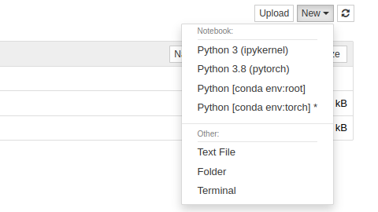

# Installing Miniconda and Pytorch

I found a great video walk through by @jeffheaton that made it very easy to get up and running.  

* [Jeff's Video](https://www.youtube.com/watch?v=YTvVxYneu7w)

* [Jeff's Github](https://github.com/jeffheaton/t81_558_deep_learning/)

## Steps

1. Install latest video graphics card drivers, I've used nvidia-driver-515 on Ubuntu 22.04

2. Install Miniconda from [Miniconda install](https://docs.conda.io/en/latest/miniconda.html#linux-installers). I chose [Python 3.8](https://repo.anaconda.com/miniconda/Miniconda3-py38_4.12.0-Linux-x86_64.sh) based on Jeff's recommendation

    * Download the script

        ```sh
        wget https://repo.anaconda.com/miniconda/Miniconda3-py38_4.12.0-Linux-x86_64.sh
        ```

    * make the script executable

        ```sh
        chmod +x Miniconda3-py38_4.12.0-Linux-x86_64.sh
        ```

    * run the script

        ```sh
        ./Miniconda3-py38_4.12.0-Linux-x86_64.sh 
        ```

    * During the install, it will ask for an install location. I chose the `default location`.

    * When install is finished, it will ask if you want to initialize Miniconda, choose `yes`

3. Close your terminal and open a new one (this will make sure we activate the Miniconda tooling)

4. Install Jupyter as a quick way of testing python code

    ```sh
    conda install -y jupyter
    ```

5. Create an Miniconda environment, this is where we will create an environment that holds all of our libraries, etc. Here the environment is called `torch` and it will use python 3.8

    ```sh
    conda create --name torch python=3.8
    ```

6. Switch to the new environment

    ```sh
    conda activate torch
    ```

7. Add Jupyter support

    ```sh
    conda install nb_conda
    ```

8. Install Pytorch with GPU support

    ```sh
    conda install pytorch cudatoolkit -c pytorch
    ```

9. Jeff provides a list of [additional libraries](https://github.com/jeffheaton/t81_558_deep_learning/blob/master/tools.yml) which may be helpful.

    ```sh
    wget https://raw.githubusercontent.com/jeffheaton/t81_558_deep_learning/master/tools.yml
    ```

10. Jeff provides a list of [additional libraries](https://github.com/jeffheaton/t81_558_deep_learning/blob/master/tools.yml) which may be helpful.

    ```yaml
    dependencies:
        - jupyter
        - scikit-learn
        - scipy
        - pandas
        - pandas-datareader
        - matplotlib
        - pillow
        - tqdm
        - requests
        - h5py
        - pyyaml
        - flask
        - boto3
        - pip
        - pip:
            - bayesian-optimization
            - gym
            - kaggle
    ```

    ```sh
    # get the file that contains the list of tools
    wget https://raw.githubusercontent.com/jeffheaton/t81_558_deep_learning/master/tools.yml
    # now install them
    conda env update --file tools.yml
    ```

## Testing your environment

1. Let Jupyter know about this environment

    ```sh
    python -m ipykernel install --user --name pytorch --display-name "Python 3.8 (pytorch)"
    ```

2. Start the `Jupyter Notebook` to test the environment

    ```sh
    jupyter notebook
    ```

3. When I ran the above command it opened up a web browser, but it showed an access denied error for me. I went back to the terminal and it showed a local URL I could try, so I used that instead.

    ```url
    http://localhost:8888/?token=<SOME_TOKEN_IS_SHOWN_HERE>
    ```

4. Create a Jupyter Notebook using `Python 3.8 (pytorch)` Note that the name here matches the command from step 11.  
    

5. You can now test your environment with the following code from Jeff's example:

    ```python
    # What version of Python do you have?
    import sys
    
    import torch
    import pandas as pd
    import sklearn as sk
    
    print(f"PyTorch Version: {torch.__version__}")
    print()
    print(f"Python {sys.version}")
    print(f"Pandas {pd.__version__}")
    print(f"Scikit-Learn {sk.__version__}")
    print("GPU is", "available" if torch.cuda.is_available() else "NOT AVAILABLE")
    ```

6. Click on the `Run` button. If everything went well, you should see something similar to:  
    

7. Jeff also provides a more [complex sample with the iris Dataset](https://github.com/jeffheaton/t81_558_deep_learning/blob/master/pytorch/t81_558_torch_class_reg.ipynb)

    > Note: I modified the code a bit to include the accuracy  

    ```python
    import pandas as pd
    from sklearn.model_selection import train_test_split
    from sklearn.metrics import accuracy_score
    
    import torch
    import torch.nn as nn
    import torch.nn.functional as F
    import numpy as np
    from torch.autograd import Variable
    from sklearn import preprocessing
    
    
    class Net(nn.Module):
        def __init__(self, in_count, out_count):
            super(Net, self).__init__()
            self.fc1 = nn.Linear(in_count, 50)
            self.fc2 = nn.Linear(50, 25)
            self.fc3 = nn.Linear(25, out_count)
            self.softmax = nn.Softmax(dim=1)
    
        def forward(self, x):
            x = F.relu(self.fc1(x))
            x = self.fc2(x)
            x = self.fc3(x)
            return self.softmax(x)
    
        
    df = pd.read_csv(
        "https://data.heatonresearch.com/data/t81-558/iris.csv", 
        na_values=['NA', '?'])
    
    le = preprocessing.LabelEncoder()
    
    x = df[['sepal_l', 'sepal_w', 'petal_l', 'petal_w']].values
    y = le.fit_transform(df['species'])
    classes = le.classes_
    
    x_train, x_test, y_train, y_test = train_test_split(    
        x, y, test_size=0.25, random_state=42)
    
    x_train = Variable(torch.Tensor(x_train).float())
    x_test = Variable(torch.Tensor(x_test).float())
    y_train = Variable(torch.Tensor(y_train).long())
    y_test = Variable(torch.Tensor(y_test).long())
    
    net = Net(x.shape[1],len(classes))
    
    criterion = nn.CrossEntropyLoss()# cross entropy loss
    
    #optimizer = torch.optim.SGD(net.parameters(), lr=0.01)
    optimizer = torch.optim.Adam(net.parameters(), lr=0.01)
    
    for epoch in range(1000):
        optimizer.zero_grad()
        out = net(x_train)
        loss = criterion(out, y_train)
        loss.backward()
        optimizer.step()
        
        if epoch % 100 == 0:
            print(f"Epoch {epoch}, loss: {loss.item()}")
    
    pred_prob = net(x_test)
    _, pred = torch.max(pred_prob, 1)

    correct = accuracy_score(y_test,pred)
    print(f"Accuracy: {correct}")
   ```

8. After running the sample, you should get something similar to:

    ```shell
    Epoch 0, loss: 1.136345386505127
    Epoch 100, loss: 0.5754801034927368
    Epoch 200, loss: 0.5720409154891968
    Epoch 300, loss: 0.5706117749214172
    Epoch 400, loss: 0.5699999332427979
    Epoch 500, loss: 0.5697137117385864
    Epoch 600, loss: 0.5695660710334778
    Epoch 700, loss: 0.5694828033447266
    Epoch 800, loss: 0.5694321393966675
    Epoch 900, loss: 0.5693994760513306

    Accuracy: 0.9736842105263158

    ```
