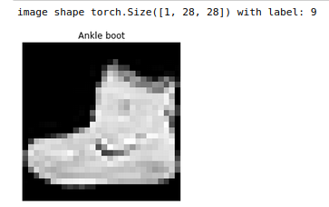
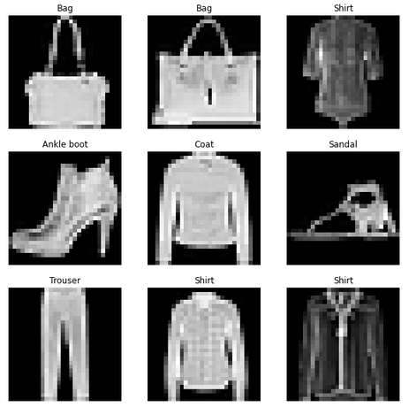
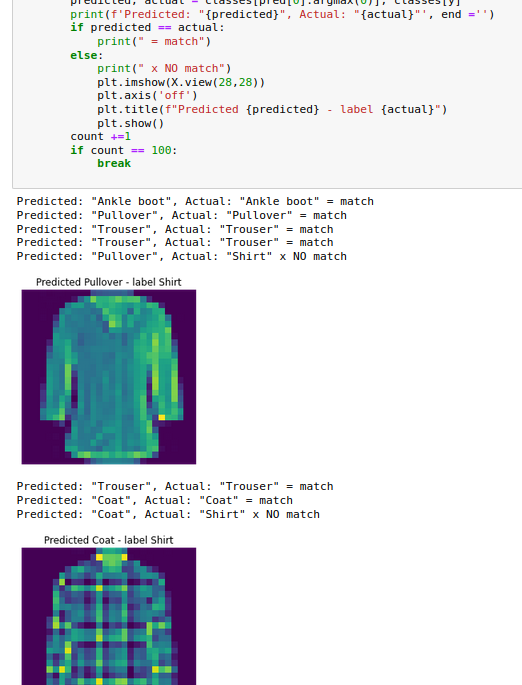

# Running Tutorials

Once you have an environment setup, you can run the [tutorials from pytorch.org](https://pytorch.org/tutorials/beginner/basics/intro.html) locally

## Checking your environment

Make sure you are in the correct conda environment. If you followed the [Install document](install.md), then you should be using `torch` as your conda environment. Switch to `torch` with:

```shell
conda activate torch
```

To make running code easier, you can start a jupyter notebook by running the following:

```shell
jupyter notebook
```

As a sanity check, run the following code to make sure you are using the correct environment

```python
import sys
import torch
import os
print(f"Conda Environment: {os.environ['CONDA_DEFAULT_ENV']}")

print(f"PyTorch Version: {torch.__version__}")
print()
print(f"Python {sys.version}")
print("GPU is", "available" if torch.cuda.is_available() else "NOT AVAILABLE")
```

If you followed the [Install document](install.md), you should see something similar to:

```shell
Conda Environment: torch
PyTorch Version: 1.12.0

Python 3.8.13 | packaged by conda-forge | (default, Mar 25 2022, 06:04:10) 
[GCC 10.3.0]
GPU is available
```

## Quick Start Tutorial

The [Quick Start tutorial](https://pytorch.org/tutorials/beginner/basics/quickstart_tutorial.html) is a great way of checking your system and seeing how it performs.

1. Get imports and Download training/test data from the Fashion MNIST data set. This may take a while depending on your network speed.  

    ```python
    import torch
    from torch import nn
    from torch.utils.data import DataLoader
    from torchvision import datasets
    from torchvision.transforms import ToTensor
    
    # Download training data from open datasets.
    training_data = datasets.FashionMNIST(
        root="data",
        train=True,
        download=True,
        transform=ToTensor(),
    )
    
    # Download test data from open datasets.
    test_data = datasets.FashionMNIST(
        root="data",
        train=False,
        download=True,
        transform=ToTensor(),
    )

    print(f"Training {training_data}")
    print(f"Testing {test_data}")
    ```

    The data will be downloaded to the `root` folder, which we specified to be `data`. You should have a `data` folder after the command finishes.

    The above code should show something similar to:

    ```shell
    Training Dataset FashionMNIST
        Number of datapoints: 60000
        Root location: data
        Split: Train
        StandardTransform
    Transform: ToTensor()
    Testing Dataset FashionMNIST
        Number of datapoints: 10000
        Root location: data
        Split: Test
        StandardTransform
    Transform: ToTensor()
    ```

    Note that we have 60000 data points in our Training set and 10000 in our Testing set.

### Exploring the Fashion MNIST data

The Fashion MNIST data was created as another training / testing set. To learn more about Fashion MNIST, go to the [Fashion MNIST GitHub](https://github.com/zalandoresearch/fashion-mnist).

In order to get a feel for what the data looks like, we can pull an image and show it. Python lets us use tuples to get data, so we leverage that to pull an image and it's label from our Training set. We can then print out the contents:

```python
# Get first training sample
image, label = training_data[0]
print(f"image shape: {image.shape} with label: {label}")
```

the result should be similar to:

```shell
image shape: torch.Size([1, 28, 28]) with label: 9
```

Note that the image shape is 1, 28, 28 which corresponds to [color-channels, height, width]. Our image is grayscale, so there is only 1 color channel and the height and width are both 28. Label is `9` which is the numeric representation of our label.

#### Visualizing Fashion MNIST

The Fashion MNIST data is labeled using the following mapping. The details come from the [Fashion MNIST Github](https://github.com/zalandoresearch/fashion-mnist#labels):

```python
classes = [
    "T-shirt/top",
    "Trouser",
    "Pullover",
    "Dress",
    "Coat",
    "Sandal",
    "Shirt",
    "Sneaker",
    "Bag",
    "Ankle boot",
    ]
```

We can use the `label` from before to get the mapping:

```python
print(f"Label: {classes[label]}")
```

which should print out:

```shell
Label: Ankle boot
```

Now to show the image, we can use all the previous code and matplot:

```python
import matplotlib.pyplot as plt
# get the first item from our training_data
image, label = training_data[0]
print(f"image shape {image.shape} with label: {label}")
# image shape is [1, 28, 28] (color-channels, height, width)
# we can use the squeeze method to remove the color channels and show the image
# we set the color map (cmap) to gray to match the original image
plt.imshow(image.squeeze(), cmap='gray')
# remove the axis since this is a picture
plt.axis('off')
# we use the mapping to pull out the label
plt.title(classes[label]);
plt.show()
```

The result should be similar to this:



Explore the other images / labels in the data set to get a feel for the data.
We can show a few images at a time with the following code:

```python
import matplotlib.pyplot as plt
import random

# Plot more images
figure = plt.figure(figsize=(10, 10))
rows, cols = 3, 3
for i in range(1, rows * cols + 1):
    # randomly pick an image in the training data array
    random_index = random.randint(0, len(training_data))
    image, label = training_data[random_index]
    figure.add_subplot(rows, cols, i)
    # calling squeeze on the image removes the color channel dimension
    plt.imshow(image.squeeze(), cmap="gray")
    # use the mapping to get the text label
    plt.title(classes[label])
    plt.axis(False);
```

Every time the code is run, it will pick random images, but the result should be similar to this. Run the code a few times to see more examples of the images in the data set:



### Preparing our Data

Earlier we saw that `Training Dataset FashionMNIST Number of datapoints: 60000` which may be too big for our model to be loaded into the GPU or RAM. We can get around such limitations by using batches.

Note: The FashionMNIST set is relatively small, but in general *real* data sets will be too big for our GPU or RAM to handle, so we learn how to break our data set into batches.

1. We break our data into batches of `batch_size` since it can be huge. We can then use a `DataLoader` to iterate over the data one `batch_size` at a time.

    ```python
    batch_size = 32

    # Create data loaders
    train_dataloader = DataLoader(training_data, batch_size=batch_size)
    test_dataloader = DataLoader(test_data, batch_size=batch_size)
    
    for images_batch, labels_batch in train_dataloader:
        print(f"Shape of images batch [N, C, H, W]: {images_batch.shape}")
        print(f"Shape of labels batch: {labels_batch.shape} {labels_batch.dtype}")
        # this breaks out of the for loop after just one run
        break
    ```

    You should see something similar to:

    ```shell
    Shape of images batch [N, C, H, W]: torch.Size([32, 1, 28, 28])
    Shape of labels batch: torch.Size([32]) torch.int64
    ```

    Notice that from images batch:
    * N is the number of items, comes from the `batch_size` we specified earlier
    * C is the color channels (our images are grayscale)
    * H is Height and W is Width - should both be 28, since the images in the Fashion MNIST data set are cropped to 28x28.  
    * To learn more about Fashion MNIST, go to the [Fashion MNIST GitHub](https://github.com/zalandoresearch/fashion-mnist)  
    * labels_batch consists of `batch_size` number of elements which are the labels associated with the images_batch

2. We now want to determine if we should run on the GPU(cuda) or CPU

    ```python
    # Get cpu or gpu device for training.
    device = "cuda" if torch.cuda.is_available() else "cpu"
    print(f"Using {device} device")
    ```

    You should see something similar to:

    ```shell
    Using cuda device
    ```

3. Now define a model to be used and move it to the device, in our case it should be GPU

    ```python
    # Define model
    class NeuralNetwork(nn.Module):
        def __init__(self):
            super(NeuralNetwork, self).__init__()
            self.flatten = nn.Flatten()
            self.linear_relu_stack = nn.Sequential(
                # note here that 28*28 refers to the Height and Width from above
                nn.Linear(28*28, 512),
                nn.ReLU(),
                nn.Linear(512, 512),
                nn.ReLU(),
                nn.Linear(512, 10)
            )
    
        def forward(self, x):
            x = self.flatten(x)
            logits = self.linear_relu_stack(x)
            return logits
    
    model = NeuralNetwork().to(device)
    # print the model so we know what we are looking at
    # in_features=784 corresponds to 28*28 which is the flattened version of 28*28 of our image
    print(model)
    ```

    You should see something similar to:

    ```shell
    NeuralNetwork(
      (flatten): Flatten(start_dim=1, end_dim=-1)
      (linear_relu_stack): Sequential(
        (0): Linear(in_features=784, out_features=512, bias=True)
        (1): ReLU()
        (2): Linear(in_features=512, out_features=512, bias=True)
        (3): ReLU()
        (4): Linear(in_features=512, out_features=10, bias=True)
      )
    )    
    ```

4. Define a way of Training and Testing the current model

    ```python
    loss_fn = nn.CrossEntropyLoss()
    optimizer = torch.optim.SGD(model.parameters(), lr=1e-3)
    
    def train(dataloader, model, loss_fn, optimizer):
        size = len(dataloader.dataset)
        model.train()
        for batch, (X, y) in enumerate(dataloader):
            X, y = X.to(device), y.to(device)
            
            # Compute prediction error
            pred = model(X)
            loss = loss_fn(pred, y)
            
            # Back Propagation
            optimizer.zero_grad()
            loss.backward()
            optimizer.step()
            
            if batch % 100 == 0:
                loss, current = loss.item(), batch * len(X)
                print(f"loss: {loss:>7f}  [{current:>5d}/{size:>5d}]")

    def test(dataloader, model, loss_fn):
        size = len(dataloader.dataset)
        num_batches = len(dataloader)
        model.eval()
        test_loss, correct = 0, 0
        with torch.no_grad():
            for X, y in dataloader:
                X, y = X.to(device), y.to(device)
                pred = model(X)
                test_loss += loss_fn(pred, y).item()
                correct += (pred.argmax(1) == y).type(torch.float).sum().item()
        test_loss /= num_batches
        correct /= size
        print(f"Test Error: \n Accuracy: {(100*correct):>0.1f}%, Avg loss: {test_loss:>8f} \n")
    ```

5. Train on the data set! This step can take a while depending on number of epochs chosen.

    > Note: you should see the test **Accuracy Go Up** and **Avg Loss Go Down** each epoch.  Something neat to try is **changing the number of epochs** to see if you can **improve the accuracy**

    ```python
    import time
    start_time = time.time()

    print("Begin Training...")
    epochs = 5
    for t in range(epochs):
        print(f"Epoch {t+1}\n-------------------------------")
        train(train_dataloader, model, loss_fn, optimizer)
        test(test_dataloader, model, loss_fn)
    print("Finished Training... took ", time.time() - start_time, " secs")
    ```

6. In order to re-use your model, you can save it:

    ```python
    torch.save(model.state_dict(), "model.pth")
    print("Saved PyTorch Model State to model.pth")
    ```

7. Once you save your model, you can load it with:

    ```python
    model = NeuralNetwork()
    model.load_state_dict(torch.load("model.pth"))
    ```

8. Once we load the model, we can use it to make predictions.

    > Note that the labels for the images are specific to the Fashion MNIST data set. To learn more go to the [Fashion MNIST GitHub](https://github.com/zalandoresearch/fashion-mnist) and look at the section called [Labels](https://github.com/zalandoresearch/fashion-mnist#labels)

    ```python
    classes = [
    "T-shirt/top",
    "Trouser",
    "Pullover",
    "Dress",
    "Coat",
    "Sandal",
    "Shirt",
    "Sneaker",
    "Bag",
    "Ankle boot",
    ]

    model.eval()
    x, y = test_data[0][0], test_data[0][1]
    with torch.no_grad():
        pred = model(x)
        predicted, actual = classes[pred[0].argmax(0)], classes[y]
        print(f'Predicted: "{predicted}", Actual: "{actual}"')
    ```

    You should see something similar to:

    ```shell
    Predicted: "Ankle boot", Actual: "Ankle boot"
    ```

    If your `Predicted` doesn't match the `Actual`, you can increase the number of epochs to get your accuracy to go up.

## Playing with CPU and GPU

In order to test the difference between CPU and GPU Acceleration, you can run the following code:

```python
# Use the CPU
import torch
from torch import nn
from torch.utils.data import DataLoader
from torchvision import datasets
from torchvision.transforms import ToTensor

# Download training data from open datasets.
training_data = datasets.FashionMNIST(
    root="data",
    train=True,
    download=True,
    transform=ToTensor(),
)

# Download test data from open datasets.
test_data = datasets.FashionMNIST(
    root="data",
    train=False,
    download=True,
    transform=ToTensor(),
)

batch_size = 32

# Create data loaders
train_dataloader = DataLoader(training_data, batch_size=batch_size)
test_dataloader = DataLoader(test_data, batch_size=batch_size)

for images_batch, labels_batch in train_dataloader:
    print(f"Shape of images batch [N, C, H, W]: {images_batch.shape}")
    print(f"Shape of labels batch: {labels_batch.shape} {labels_batch.dtype}")
    # this breaks out of the for loop after just one run
    break

# Define model
class NeuralNetwork(nn.Module):
    def __init__(self):
        super(NeuralNetwork, self).__init__()
        self.flatten = nn.Flatten()
        self.linear_relu_stack = nn.Sequential(
            # note here that 28*28 refers to the Height and Width from above
            nn.Linear(28*28, 512),
            nn.ReLU(),
            nn.Linear(512, 512),
            nn.ReLU(),
            nn.Linear(512, 10)
        )

    def forward(self, x):
        x = self.flatten(x)
        logits = self.linear_relu_stack(x)
        return logits

model = NeuralNetwork()
# print the model so we know what we are looking at
# in_features=784 corresponds to 28*28 which is the flattened version of 28*28 of our image
print(model)

loss_fn = nn.CrossEntropyLoss()
optimizer = torch.optim.SGD(model.parameters(), lr=1e-3)

def train(dataloader, model, loss_fn, optimizer):
    size = len(dataloader.dataset)
    model.train()
    for batch, (X, y) in enumerate(dataloader):      
        # Compute prediction error
        pred = model(X)
        loss = loss_fn(pred, y)
        
        # Back Propagation
        optimizer.zero_grad()
        loss.backward()
        optimizer.step()
        
        if batch % 100 == 0:
            loss, current = loss.item(), batch * len(X)
            print(f"loss: {loss:>7f}  [{current:>5d}/{size:>5d}]")

def test(dataloader, model, loss_fn):
    size = len(dataloader.dataset)
    num_batches = len(dataloader)
    model.eval()
    test_loss, correct = 0, 0
    with torch.no_grad():
        for X, y in dataloader:
            pred = model(X)
            test_loss += loss_fn(pred, y).item()
            correct += (pred.argmax(1) == y).type(torch.float).sum().item()
    test_loss /= num_batches
    correct /= size
    print(f"Test Error: \n Accuracy: {(100*correct):>0.1f}%, Avg loss: {test_loss:>8f} \n")

import time
start_time = time.time()

print("Begin Training...")
epochs = 5
for t in range(epochs):
    print(f"Epoch {t+1}\n-------------------------------")
    train(train_dataloader, model, loss_fn, optimizer)
    test(test_dataloader, model, loss_fn)
print("Finished Training... took ", time.time() - start_time, " secs")


torch.save(model.state_dict(), "cpu_model.pth")
print("Saved PyTorch Model State to cpu_model.pth")

model = NeuralNetwork()
model.load_state_dict(torch.load("cpu_model.pth"))

classes = [
"T-shirt/top",
"Trouser",
"Pullover",
"Dress",
"Coat",
"Sandal",
"Shirt",
"Sneaker",
"Bag",
"Ankle boot",
]

model.eval()
x, y = test_data[0][0], test_data[0][1]
with torch.no_grad():
    pred = model(x)
    predicted, actual = classes[pred[0].argmax(0)], classes[y]
    print(f'Predicted: "{predicted}", Actual: "{actual}"')

```

The GPU code is consolidated here for easy reference:

```python
# Use the GPU
import torch
from torch import nn
from torch.utils.data import DataLoader
from torchvision import datasets
from torchvision.transforms import ToTensor

# Download training data from open datasets.
training_data = datasets.FashionMNIST(
    root="data",
    train=True,
    download=True,
    transform=ToTensor(),
)

# Download test data from open datasets.
test_data = datasets.FashionMNIST(
    root="data",
    train=False,
    download=True,
    transform=ToTensor(),
)

batch_size = 32

# Create data loaders
train_dataloader = DataLoader(training_data, batch_size=batch_size)
test_dataloader = DataLoader(test_data, batch_size=batch_size)

for images_batch, labels_batch in train_dataloader:
    print(f"Shape of images batch [N, C, H, W]: {images_batch.shape}")
    print(f"Shape of labels batch: {labels_batch.shape} {labels_batch.dtype}")
    # this breaks out of the for loop after just one run
    break

# Get cpu or gpu device for training.
device = "cuda" if torch.cuda.is_available() else "cpu"
print(f"Using {device} device")

# Define model
class NeuralNetwork(nn.Module):
    def __init__(self):
        super(NeuralNetwork, self).__init__()
        self.flatten = nn.Flatten()
        self.linear_relu_stack = nn.Sequential(
            # note here that 28*28 refers to the Height and Width from above
            nn.Linear(28*28, 512),
            nn.ReLU(),
            nn.Linear(512, 512),
            nn.ReLU(),
            nn.Linear(512, 10)
        )

    def forward(self, x):
        x = self.flatten(x)
        logits = self.linear_relu_stack(x)
        return logits

model = NeuralNetwork().to(device)
# print the model so we know what we are looking at
# in_features=784 corresponds to 28*28 which is the flattened version of 28*28 of our image
print(model)

loss_fn = nn.CrossEntropyLoss()
optimizer = torch.optim.SGD(model.parameters(), lr=1e-3)

def train(dataloader, model, loss_fn, optimizer):
    size = len(dataloader.dataset)
    model.train()
    for batch, (X, y) in enumerate(dataloader):
        X, y = X.to(device), y.to(device)
        
        # Compute prediction error
        pred = model(X)
        loss = loss_fn(pred, y)
        
        # Back Propagation
        optimizer.zero_grad()
        loss.backward()
        optimizer.step()
        
        if batch % 100 == 0:
            loss, current = loss.item(), batch * len(X)
            print(f"loss: {loss:>7f}  [{current:>5d}/{size:>5d}]")

def test(dataloader, model, loss_fn):
    size = len(dataloader.dataset)
    num_batches = len(dataloader)
    model.eval()
    test_loss, correct = 0, 0
    with torch.no_grad():
        for X, y in dataloader:
            X, y = X.to(device), y.to(device)
            pred = model(X)
            test_loss += loss_fn(pred, y).item()
            correct += (pred.argmax(1) == y).type(torch.float).sum().item()
    test_loss /= num_batches
    correct /= size
    print(f"Test Error: \n Accuracy: {(100*correct):>0.1f}%, Avg loss: {test_loss:>8f} \n")

import time
start_time = time.time()

print("Begin Training...")
epochs = 5
for t in range(epochs):
    print(f"Epoch {t+1}\n-------------------------------")
    train(train_dataloader, model, loss_fn, optimizer)
    test(test_dataloader, model, loss_fn)
print("Finished Training... took ", time.time() - start_time, " secs")


classes = [
"T-shirt/top",
"Trouser",
"Pullover",
"Dress",
"Coat",
"Sandal",
"Shirt",
"Sneaker",
"Bag",
"Ankle boot",
]

model.eval()
x, y = test_data[0][0], test_data[0][1]
with torch.no_grad():
    pred = model(x)
    predicted, actual = classes[pred[0].argmax(0)], classes[y]
    print(f'Predicted: "{predicted}", Actual: "{actual}"')
```

## Explore the Fashion MNIST data

Since we have a model and some testing data, we can loop over the test data and see how our model performs.

* If using the CPU, use this code:

    ```python
    # Use the CPU
    with torch.no_grad():
        count = 0
        for X, y in test_data:
            pred = model(X)
            predicted, actual = classes[pred[0].argmax(0)], classes[y]
            print(f'Predicted: "{predicted}", Actual: "{actual}"', end ='')
            if predicted == actual:
                print(" = match")
            else:
                print(" x NO match")
                plt.imshow(X.view(28,28))
                plt.axis('off')
                plt.title(f"Predicted {predicted} - label {actual}")
                plt.show()
            # only show the first 100 test images
            # otherwise it takes a very long time
            count += 1
            if count == 100:
                break
    ```

* If using the GPU, use this code:

    ```python
    #Use the GPU
    with torch.no_grad():
        count = 0
        for X, y in test_data:
            pred = model(X)
            predicted, actual = classes[pred[0].argmax(0)], classes[y]
            print(f'Predicted: "{predicted}", Actual: "{actual}"', end ='')
            if predicted == actual:
                print(" = match")
            else:
                print(" x NO match")
                plt.imshow(X.cpu().view(28,28))
                plt.axis('off')
                plt.title(f"Predicted {predicted} - label {actual}")
                plt.show()
            # only show the first 100 test images
            # otherwise it takes a very long time
            count += 1
            if count == 100:
                break
    ```

* You may have to re-load the test_data if jupyter notebook freaks out

    ```python
    test_data = datasets.FashionMNIST(
        root="data",
        train=False,
        download=True,
        transform=ToTensor(),
    )
    ```

### Exploring Fashion MNIST Accuracy

When running the above code, regardless of on GPU or CPU, we can plot the error images to get a feel for what the neural net is doing. You should see something similar to the following:



## Conclusion

That concludes the intro tutorial from pytorch.org.
I've included several other tutorials in the [README.md](README.md) file if you want to learn more.

I can be reached at [@IAmDanielV](https://twitter.com/iamdanielv) on Twitter if you have any questions or suggestions.

Thanks!
