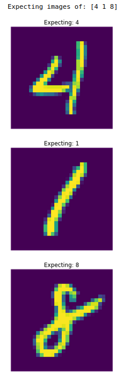
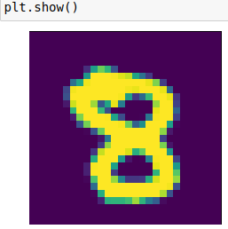

# Introduction

There is a nice tutorial available at [Introduction - Deep Learning and Neural Networks with Python and Pytorch](https://pythonprogramming.net/introduction-deep-learning-neural-network-pytorch/). Part 1 has a good overview of how Neural Networks work and getting started. Part 2 gets into working with data and that is what I will be using here - [pythonprogramming.net - Data - Deep Learning and Neural Networks with Python](https://pythonprogramming.net/data-deep-learning-neural-network-pytorch/) There is a video walk through and code available on the site, I have copied it here for easy reference. I've also made some modifications to the code to make it easier for me to understand what is happening.

## Checking your environment

Make sure you are in the correct conda environment. If you followed the [Install document](installPyTorch.md), then you should be using `torch` as your conda environment. Switch to `torch` with:

```shell
conda activate torch
```

To make running code easier, you can start a jupyter notebook by running the following:

```shell
jupyter notebook
```

As a sanity check, run the following code to make sure you are using the correct environment and using the GPU

```python
import sys
import torch
import os
print(f"Conda Environment: {os.environ['CONDA_DEFAULT_ENV']}")

print(f"PyTorch Version: {torch.__version__}")
print()
print(f"Python {sys.version}")
print("GPU is", "available" if torch.cuda.is_available() else "NOT AVAILABLE")
```

If you followed the [Install document](installPyTorch.md), you should see something similar to:

```shell
Conda Environment: torch
PyTorch Version: 1.12.0

Python 3.8.13 (default, Mar 28 2022, 11:38:47) 
[GCC 7.5.0]
GPU is available
```

The versions of Python and GCC may change, but you want to make sure you are in the `torch` Conda Environment and that `GPU is available`

## Deep Learning and Neural Networks with Python

Load the sample train and test data.

>Note: I changed the directory to use `data` instead of the current directory, this matches with the other tutorial. The first time you run these commands it will download the data, so it may take a while depending on network connection speed. The `data` folder should contain `MNIST` after running the code.

```python
import torch
import torchvision
from torchvision import transforms, datasets

train = datasets.MNIST(
    root='data',
    train=True,
    download=True,
    transform=transforms.Compose([
                           transforms.ToTensor()
    ]))

test = datasets.MNIST(
    root='data',
    train=False,
    download=True,
    transform=transforms.Compose([
                           transforms.ToTensor()
    ]))
```

Once we have the data, we can write some code to iterate through it, there are more details on what the next bit of code does in the tutorial. I won't copy it here.

### Exploring a subset of the data

>Note: I changed the batch_size to 3 in order to make it easier to understand what the data looks like.

```python
trainset = torch.utils.data.DataLoader(train, batch_size=3, shuffle=True)
testset = torch.utils.data.DataLoader(test, batch_size=3, shuffle=False)
```

In order to get a better understanding of what the data looks like, we can examine a single sample instance

>Note that since the trainset has a batch size of 3, we will only get sample batches of 3 at a time

```python
import matplotlib.pyplot as plt

# get one iteration of the batch
sample = next(iter(trainset))
# pull out the image tensor
images = sample[0]
# pull out the labels tensor
labels = sample[1]

# you can uncomment the following lines to get a better feel for the data
# this is the whole sample
#print(sample)
# this is just the raw image data
#print(f"raw images {images}")
# this is the tensor containing the labels
print(f"Expecting images of: {labels.numpy()}")
for i, image in enumerate(images):
    plt.axis('off')
    plt.title(f"Expecting: {labels[i].item()}")
    plt.imshow(image.view(28,28))
    plt.show()
```

The code above will print the contents of the 3 images we are pulling from the trainset. Note that the images will be different every time this is run since we shuffle the trainset every time we pull from it. It should look something like:



### Back to the data from the tutorial

Now that we understand what the data looks like, we can switch back to the **batch size of 10** used in the tutorial.

```python
trainset = torch.utils.data.DataLoader(
    train,
    batch_size=10,
    shuffle=True)
testset = torch.utils.data.DataLoader(
    test,
    batch_size=10,
    shuffle=False)

for data in trainset:
    # this will print both the raw image data and the current set of labels
    print(data)
    break
```

after running the above code, it should look something like:

```shell
[tensor([[[[0., 0., 0.,  ..., 0., 0., 0.],
          [0., 0., 0.,  ..., 0., 0., 0.],
          [0., 0., 0.,  ..., 0., 0., 0.],
          ...,
          [0., 0., 0.,  ..., 0., 0., 0.],
          [0., 0., 0.,  ..., 0., 0., 0.],
          [0., 0., 0.,  ..., 0., 0., 0.]]],


        [[[0., 0., 0.,  ..., 0., 0., 0.],
          [0., 0., 0.,  ..., 0., 0., 0.],
          [0., 0., 0.,  ..., 0., 0., 0.],
          ...,
          [0., 0., 0.,  ..., 0., 0., 0.],
          [0., 0., 0.,  ..., 0., 0., 0.],
          [0., 0., 0.,  ..., 0., 0., 0.]]],


        [[[0., 0., 0.,  ..., 0., 0., 0.],
          [0., 0., 0.,  ..., 0., 0., 0.],
          [0., 0., 0.,  ..., 0., 0., 0.],
          ...,
          [0., 0., 0.,  ..., 0., 0., 0.],
          [0., 0., 0.,  ..., 0., 0., 0.],
          [0., 0., 0.,  ..., 0., 0., 0.]]],


        ...,


        [[[0., 0., 0.,  ..., 0., 0., 0.],
          [0., 0., 0.,  ..., 0., 0., 0.],
          [0., 0., 0.,  ..., 0., 0., 0.],
          ...,
          [0., 0., 0.,  ..., 0., 0., 0.],
          [0., 0., 0.,  ..., 0., 0., 0.],
          [0., 0., 0.,  ..., 0., 0., 0.]]],


        [[[0., 0., 0.,  ..., 0., 0., 0.],
          [0., 0., 0.,  ..., 0., 0., 0.],
          [0., 0., 0.,  ..., 0., 0., 0.],
          ...,
          [0., 0., 0.,  ..., 0., 0., 0.],
          [0., 0., 0.,  ..., 0., 0., 0.],
          [0., 0., 0.,  ..., 0., 0., 0.]]],


        [[[0., 0., 0.,  ..., 0., 0., 0.],
          [0., 0., 0.,  ..., 0., 0., 0.],
          [0., 0., 0.,  ..., 0., 0., 0.],
          ...,
          [0., 0., 0.,  ..., 0., 0., 0.],
          [0., 0., 0.,  ..., 0., 0., 0.],
          [0., 0., 0.,  ..., 0., 0., 0.]]]]), tensor([8, 5, 9, 4, 9, 3, 6, 3, 0, 4])]

```

the variable data will have `data[0]` as the input data set and `data[1]` as the current set of labels. We can pull them out into X and y

```python
# the variable data is still available here
# We can pull out the first element of the tensor
# so that we can examine it
X, y = data[0][0], data[1][0]
```

X is our raw image data and y is our current label. In the above example, X should contain a picture of 8 and y should contain the label "8"

We can check with:

```python
print(f"Raw Image:\n{X}")
print(f"label: {y}")
```

it should respond with something similar to:

```shell
Raw Image:
tensor([[[0.0000, 0.0000, 0.0000, 0.0000, 0.0000, 0.0000, 0.0000, 0.0000,
          0.0000, 0.0000, 0.0000, 0.0000, 0.0000, 0.0000, 0.0000, 0.0000,
          0.0000, 0.0000, 0.0000, 0.0000, 0.0000, 0.0000, 0.0000, 0.0000,
          0.0000, 0.0000, 0.0000, 0.0000],
          # RAW image data should be here, but removed for brevity
         [0.0000, 0.0000, 0.0000, 0.0000, 0.0000, 0.0000, 0.0000, 0.0000,
          0.0000, 0.0000, 0.0000, 0.0000, 0.0000, 0.0000, 0.0000, 0.0000,
          0.0000, 0.0000, 0.0000, 0.0000, 0.0000, 0.0000, 0.0000, 0.0000,
          0.0000, 0.0000, 0.0000, 0.0000]]])
label: 8
```

### Visualizing the raw data

Looking at the raw image data we can't really tell if it's an 8, but we can use pyplot to show the image.

```python
import matplotlib.pyplot as plt

plt.imshow(data[0][0].view(28,28))
plt.axis('off')
plt.show()
```

it should show something similar to:



Based on the results from printing the data earlier, we can also examine the other elements:

```shell
tensor([8, 5, 9, 4, 9, 3, 6, 3, 0, 4])
```

and expect data[0][1] to contain a "5", data[0][2] to contain a "9", data[0][3] to contain a "4" and so on. Try it in the editor to verify.

Important Note :exclamation: The values in the image and label sets will be different since we shuffle the training data on every run.

## Scaling our raw data

From the tutorial we learn that our Neural Network likes data to be scaled from 0 to 1. To see if it is scaled, we can print out a single row of the raw image. For this example we pick something in the middle of the image, remember that our image is 28x28 so 14 should be in the middle.

```python
print(data[0][0][0][14])
```

​it should respond with something similar to:

```shell
tensor([0.0000, 0.0000, 0.0000, 0.0000, 0.0000, 0.0000, 0.0000, 0.0000, 0.0000,
        0.0000, 0.0588, 0.4078, 0.9961, 0.9961, 0.9961, 0.9961, 0.9961, 0.9961,
        0.9961, 0.1922, 0.0000, 0.0000, 0.0000, 0.0000, 0.0000, 0.0000, 0.0000,
        0.0000])
```

We can see that the image data has already been scaled for us.

## Balancing inputs

The tutorial then goes on to explain how we can look at our data to see if it is balanced, refer to the tutorial for a more through explanation.

### Counting training set sample digits

To get a sense of what our sample data looks like, we can count the number of times a digit appears. The following code may take a while to run since it will iterate through the entire training set.

```python
total = 0
# we use a dictionary to keep track of our count
counter_dict = {0:0, 1:0, 2:0, 3:0, 4:0, 5:0, 6:0, 7:0, 8:0, 9:0}

print("Start counting inputs")

for data in trainset:
    Xs, ys = data
    for y in ys:
        counter_dict[int(y)] += 1
        total += 1

print(f"Entire Dictionary {counter_dict}\n")

print("Frequency")
for i in counter_dict:
    print(f"{i}: {counter_dict[i]/total*100.0}%")

print("Finished")
```

it should respond with something similar to:

```shell
Entire Dictionary {0: 5923, 1: 6742, 2: 5958, 3: 6131, 4: 5842, 5: 5421, 6: 5918, 7: 6265, 8: 5851, 9: 5949}
frequency
0: 9.871666666666666%
1: 11.236666666666666%
2: 9.93%
3: 10.218333333333334%
4: 9.736666666666666%
5: 9.035%
6: 9.863333333333333%
7: 10.441666666666666%
8: 9.751666666666667%
9: 9.915000000000001%
```

## Creating a Neural Network

In the previous steps, we loaded a sample training set and explored it. We are now ready to Create a Neural Network! This is following [Building our Neural Network - Deep Learning and Neural Networks with Python and Pytorch p.3](https://pythonprogramming.net/building-deep-learning-neural-network-pytorch/)

We start out by importing some of the pytorch neural network functions.

```python
import torch.nn as nn
import torch.nn.functional as F
```

### Creating a Class for our Neural Network Model

The tutorial goes into some explanation as to how we do init, but I have skipped it here to focus on the Model.

From the tutorial, we have a couple of functions (fc1, fc2, fc3, fc4). The functions will map to different layers used by our model.

```python
class Net(nn.Module):
  def __init__(self):
    super().__init__()
    # 28x28 is the size of our input image, and 64 is the number of output features
    self.fc1 = nn.Linear(28*28, 64)
    # the second layer takes in the output from fc1 and outputs 64 features
    self.fc2 = nn.Linear(64, 64)
    # the third layer takes in the output from fc2 and outputs 64 features
    self.fc3 = nn.Linear(64, 64)
    # the fourth layer takes in the output from fc3 and outputs 10 features
    # 10 is the number of "buckets" / classes that we want our data to be grouped into
    # In our use case it is the numbers: 0, 1, 2, 3, 4, 5, 6, 7, 8, 9
    self.fc4 = nn.Linear(64, 10)

  # the forward function is how data passes through the model
  # in this case x is the raw image data being passed in as input
  # relu refers to Rectified linear function (scaled between 0 and 1)
  def forward(self, x):
      x = F.relu(self.fc1(x))
      x = F.relu(self.fc2(x))
      x = F.relu(self.fc3(x))
      x = self.fc4(x)
      return F.log_softmax(x, dim=1)

net = Net()
print(net)
```

### Playing with random data

Create some random data to play with our model. There is a good explanation in the tutorial, make sure to read it.

```python
X = torch.randn((28,28))
X = X.view(-1,28*28)

output = net(X)
print(output)
```

## Training a Neural Network

In the previous steps, we created a Neural Network Model and pushed some random data through it. Now we want to actually **train the Neural Network** with our sample data. This is following [Training Neural Network - Deep Learning and Neural Networks with Python and Pytorch p.4](https://pythonprogramming.net/training-deep-learning-neural-network-pytorch/).

For simplicity, here is the code so far. I changed where the sample data is stored compared to the tutorial and added comments to make it easier to understand.

```python
import torch
import torchvision
from torchvision import transforms, datasets
import torch.nn as nn
import torch.nn.functional as F

# This is different than the tutorial
# the sample data root is moved to `data`
train = datasets.MNIST(
    root='data',
    train=True,
    download=True,
    transform=transforms.Compose([
                           transforms.ToTensor()
    ]))

test = datasets.MNIST(
    root='data',
    train=False,
    download=True,
    transform=transforms.Compose([
                           transforms.ToTensor()
    ]))

# I split this into multiple lines to make it easier to understand
trainset = torch.utils.data.DataLoader(
    train,
    batch_size=10,
    shuffle=True)
testset = torch.utils.data.DataLoader(
    test,
    batch_size=10,
    shuffle=False)

# I've added comments to make it easier to understand
# This is our Neural Net Model
class Net(nn.Module):
  def __init__(self):
    super().__init__()
    # 28x28 is the size of our input image, and 64 is the number of output features
    self.fc1 = nn.Linear(28*28, 64)
    # the second layer takes in the output from fc1 and outputs 64 features
    self.fc2 = nn.Linear(64, 64)
    # the third layer takes in the output from fc2 and outputs 64 features
    self.fc3 = nn.Linear(64, 64)
    # the fourth layer takes in the output from fc3 and outputs 10 features
    # 10 is the number of "buckets" / classes that we want our data to be grouped into
    # In our use case it is the numbers: 0, 1, 2, 3, 4, 5, 6, 7, 8, 9
    self.fc4 = nn.Linear(64, 10)

  # the forward function is how data passes through the model
  # in this case x is the raw image data being passed in as input
  # relu refers to Rectified linear function (scaled between 0 and 1)
  def forward(self, x):
      x = F.relu(self.fc1(x))
      x = F.relu(self.fc2(x))
      x = F.relu(self.fc3(x))
      x = self.fc4(x)
      return F.log_softmax(x, dim=1)

net = Net()
print(net)
```

We can now specify the loss function and the optimizer.

```python
import torch.optim as optim

loss_function = nn.CrossEntropyLoss()
optimizer = optim.Adam(net.parameters(), lr=0.001)
```

There is a very good explanation of the loss and optimizer functions in the tutorial, I won't repeat it here. Go read it in the tutorial and come back here once you reach the epoch section.

```python
import time
start_time = time.time()

print("Begin Training...")
for epoch in range(3): # 3 full passes over the data
  print(f"Calc Epoch {epoch + 1}...", end = '') # Print the Epoch, but no new line at end
  for data in trainset:  # `data` is a batch of data
    X, y = data  # X is the batch of raw image data, y is the batch of labels for those raw images
    net.zero_grad()  # sets gradients to 0 before loss calc. You will do this likely every step.
    output = net(X.view(-1,784))  # pass in the reshaped batch (recall they are 28x28 atm)
    loss = F.nll_loss(output, y)  # calc and grab the loss value
    loss.backward()  # apply this loss backwards thru the network's parameters
    optimizer.step()  # attempt to optimize weights to account for loss/gradients
  print(f" loss: {loss.item():>.4f}")  # print loss. We hope loss (a measure of wrong-ness) declines!
print("Finished Training... took ", time.time() - start_time, " secs")
```

I've added a timer to see how long it takes to complete the Training. I also changed the output a bit to make it clearer what is happening, but it should print something similar to this:

```shell
Calc Epoch 1... loss: 0.1123
Calc Epoch 2... loss: 0.4305
Calc Epoch 3... loss: 0.0208
```

Go back to the tutorial and read about what the previous code did.

## Checking Accuracy

Now we can check the accuracy of our prediction with the following code, note that I have modified it from the tutorial to make it easier to understand what is happening. I also added a timer to see how long it takes to check accuracy:

```python
import matplotlib.pyplot as plt

correct = 0
total = 0

start_time = time.time()
print("Determine Accuracy...")
with torch.no_grad():
    for data in testset:
        X, y = data
        output = net(X.view(-1,784))
        #print(output)
        # y contains the predefined labels for this batch
        print(f"\nbatch data labels {y.numpy()}")
        for idx, i in enumerate(output):
            # idx gives us an index into the sample batch
            # i contains the probability tensor
            # torch.argmax(i) gives us the index with the highest probability
            # the highest probability is what we Predict the image to contain
            # we re-use the index as our label, so index 0 means number 0, index 1 means number 1, etc.
            # print(f"\nprobability tensor: {i}")
            print(f"Predicted: {torch.argmax(i)} , label: {y[idx]}" , end = '')
            if torch.argmax(i) == y[idx]:
                correct += 1
                print(" = match")
                # uncomment the following lines if you want to see the sample image
                # I commented it out to only show the ones where we got it wrong
                #plt.imshow(X[idx].view(28,28))
                #plt.show()
            else:
                print(" x no match")
                # since we got the answer wrong, show the image
                plt.imshow(X[idx].view(28,28))
                plt.axis('off')
                plt.title(f"Predicted {torch.argmax(i)} - label {y[idx]}")
                plt.show()
            total += 1

print("Accuracy: ", round(correct/total, 3),  " took ", time.time() - start_time, " secs")
```

## Playing with GPU Acceleration

If you want to see the difference of running the code on the GPU, you can try the following code:

```python
import torch
import torchvision
from torchvision import transforms, datasets
import torch.nn as nn
import torch.nn.functional as F

# This is different than the tutorial
# the sample data root is moved to `data`
train = datasets.MNIST(
    root='data',
    train=True,
    download=True,
    transform=transforms.Compose([
                           transforms.ToTensor()
    ]))

test = datasets.MNIST(
    root='data',
    train=False,
    download=True,
    transform=transforms.Compose([
                           transforms.ToTensor()
    ]))

# I split this into multiple lines to make it easier to understand
trainset = torch.utils.data.DataLoader(
    train,
    batch_size=10,
    shuffle=True)
testset = torch.utils.data.DataLoader(
    test,
    batch_size=10,
    shuffle=False)

# I've added comments to make it easier to understand
# This is our Neural Net Model
class Net(nn.Module):
  def __init__(self):
    super().__init__()
    # 28x28 is the size of our input image, and 64 is the number of output features
    self.fc1 = nn.Linear(28*28, 64)
    # the second layer takes in the output from fc1 and outputs 64 features
    self.fc2 = nn.Linear(64, 64)
    # the third layer takes in the output from fc2 and outputs 64 features
    self.fc3 = nn.Linear(64, 64)
    # the fourth layer takes in the output from fc3 and outputs 10 features
    # 10 is the number of "buckets" / classes that we want our data to be grouped into
    # In our use case it is the numbers: 0, 1, 2, 3, 4, 5, 6, 7, 8, 9
    self.fc4 = nn.Linear(64, 10)

  # the forward function is how data passes through the model
  # in this case x is the raw image data being passed in as input
  # relu refers to Rectified linear function (scaled between 0 and 1)
  def forward(self, x):
      x = F.relu(self.fc1(x))
      x = F.relu(self.fc2(x))
      x = F.relu(self.fc3(x))
      x = self.fc4(x)
      return F.log_softmax(x, dim=1)


# Get cpu or gpu device for training.
device = "cuda" if torch.cuda.is_available() else "cpu"
print(f"Using {device} device")

net = Net().to(device)
print(net)

import torch.optim as optim

loss_function = nn.CrossEntropyLoss()
optimizer = optim.Adam(net.parameters(), lr=0.001)

import time
start_time = time.time()

print("Begin Training...")
for epoch in range(3): # 3 full passes over the data
  print(f"Calc Epoch {epoch + 1}...", end = '') # Print the Epoch, but no new line at end
  for data in trainset:  # `data` is a batch of data
    X, y = data  # X is the batch of raw image data, y is the batch of labels for those raw images
    X, y = X.to(device), y.to(device) # move the data to the device (cpu or gpu(cuda))
    
    net.zero_grad()  # sets gradients to 0 before loss calc. You will do this likely every step.
    output = net(X.view(-1,784))  # pass in the reshaped batch (recall they are 28x28 atm)
    loss = F.nll_loss(output, y)  # calc and grab the loss value
    loss.backward()  # apply this loss backwards thru the network's parameters
    optimizer.step()  # attempt to optimize weights to account for loss/gradients
  print(f" loss: {loss.item():>.4f}")  # print loss. We hope loss (a measure of wrong-ness) declines!
print("GPU Finished Training... took ", time.time() - start_time, " secs")

import matplotlib.pyplot as plt
correct = 0
total = 0

start_time = time.time()
print("Determine Accuracy...")
with torch.no_grad():
    for data in testset:
        X, y = data
        X, y = X.to(device), y.to(device)
        output = net(X.view(-1,784))
        #print(output)
        # y contains the predefined labels for this batch
        print(f"\nbatch data labels {y.cpu().numpy()}")
        for idx, i in enumerate(output):
            # idx gives us an index into the sample batch
            # i contains the probability tensor
            # torch.argmax(i) gives us the index with the highest probability
            # the highest probability is what we Predict the image to contain
            # we re-use the index as our label, so index 0 means number 0, index 1 means number 1, etc.
            # print(f"\nprobability tensor: {i}")
            print(f"Predicted: {torch.argmax(i)} , label: {y[idx]}" , end = '')
            if torch.argmax(i) == y[idx]:
                correct += 1
                print(" = match")
                # uncomment the following lines if you want to see the sample image
                # I commented it out to only show the ones where we got it wrong
                #plt.imshow(X[idx].view(28,28))
                #plt.show()
            else:
                print(" x no match")
                # since we got the answer wrong, show the image
                plt.imshow(X[idx].cpu().view(28,28))
                plt.axis('off')
                plt.title(f"Predicted {torch.argmax(i)} - label {y[idx]}")
                plt.show()
            total += 1

print("GPU Accuracy: ", round(correct/total, 3),  " took ", time.time() - start_time, " secs")

```

## Conclusion

That concludes the tutorial from Deep Learning and Neural Networks with Python and Pytorch.
I've included several other tutorials in the [README.md](README.md) file if you want to learn more.

I can be reached at [@IAmDanielV](https://twitter.com/iamdanielv) on Twitter if you have any questions or suggestions.

Thanks!
